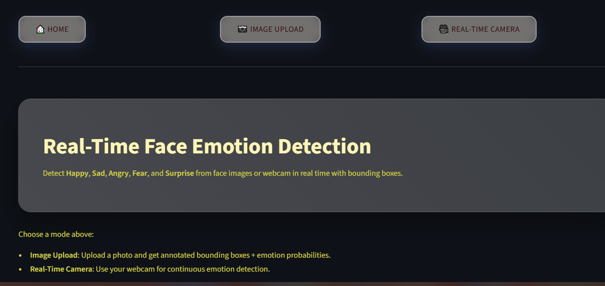
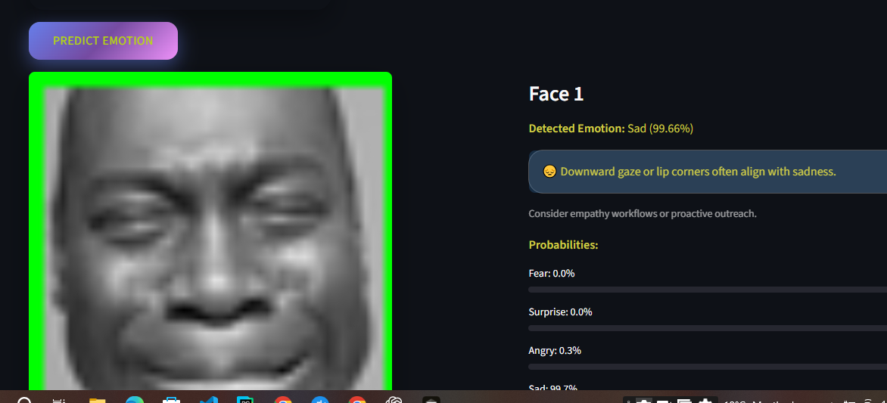
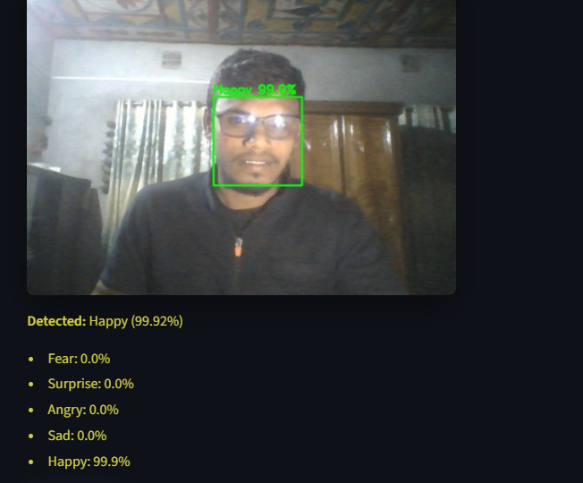

# 😃 Real-Time Face Emotion Detection (Streamlit + PyTorch)

A full-stack **face emotion recognition system** that performs:

- **Real-time emotion detection** using your webcam  
- **Image upload classification**  
- **Bounding box detection** using OpenCV Haar Cascades  
- **Emotion prediction** using a custom ResNet-inspired CNN model  
- Beautiful, modern **Streamlit UI** with CSS styling  
- Optional **FastAPI backend + Docker deployment**

---

## 🚀 Demo Screenshots

### 🔹 Home Page  


### 🔹 Image Upload Prediction  


### 🔹 Real-Time Webcam Mode  


*(You can replace these with real screenshots from your app.)*

---

## 🎯 Features

| Feature | Description |
|--------|-------------|
| 🧠 **Emotion Classification** | Happy, Sad, Angry, Fear, Surprise |
| 👁️ **Face Detection** | Bounding boxes using Haar cascades |
| 📷 **Real-time Webcam Mode** | Continuous detection from live camera |
| 📁 **Image Upload Mode** | Upload JPG/PNG for prediction |
| ⚡ **Fast & Lightweight** | Custom CNN (ResNet-inspired), runs on CPU or GPU |
| 🎨 **Modern Streamlit UI** | Custom CSS, button navigation (no sidebar) |
| 🐳 **Docker-ready** | Deploy anywhere using Docker |

---

## 🏗️ Tech Stack

- **Python 3.10+**
- **Streamlit** (front-end UI)
- **PyTorch** (deep learning model)
- **OpenCV** (face detection + drawing)
- **Docker** (optional deployment)
- **Haar Cascade** for face detection

---

## 📂 Project Structure

real-time-face-emotion-detection\
├── app\
│ └── streamlit_app.py
├── src\
│ ├── custom_resnet.py # your CNN model + prediction_img\
│ └── emotion_service.py # modular face detection + inference\
├── model\
│ └── resnet_Model.pth
├── assets\
│ ├── style.css\
│ ├──[res10_300x300_ssd_iter_140000_fp16.caffemodel](assets/res10_300x300_ssd_iter_140000_fp16.caffemodel)\
├── Dockerfile\
├── requirements.txt\
└── README.md


---

## 🛠️ Installation (Local Development)

### 1️⃣ Clone the repository

```bash
git clone https://github.com/yourusername/real-time-face-emotion-detection.git
cd real-time-face-emotion-detection
```
## Create environment & install dependencies
pip install -r requirements.txt

If using Anaconda:
```
conda create -n face-emotion python=3.12 -y
conda activate face-emotion
pip install -r requirements.txt
```
